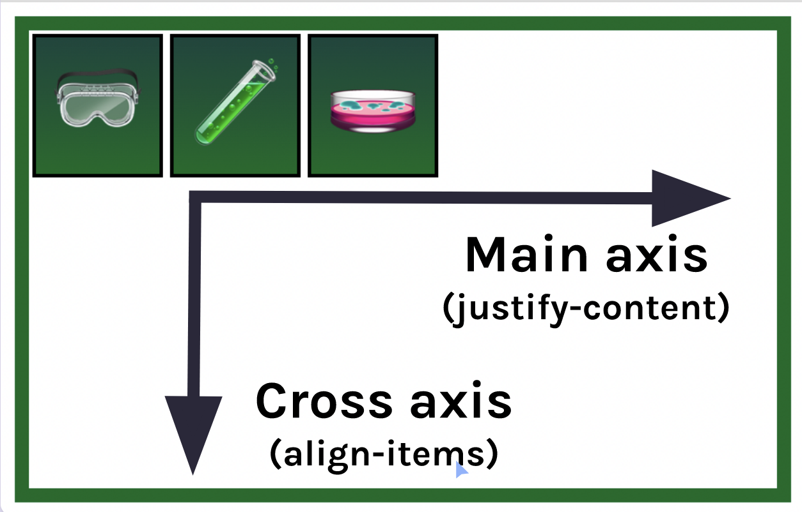

# Concepts I've learned in this project

- Flex containers using `display:flex` in the parent element (container) of the elements to distribute

- Flex directions. The `row` (horizontal) and `column` (vertical) values set which is the main axis.
  

- The `justify-content` (main axis) and `align-items` (cross axis) properties to distribute the child elements along the corresponding axis.
